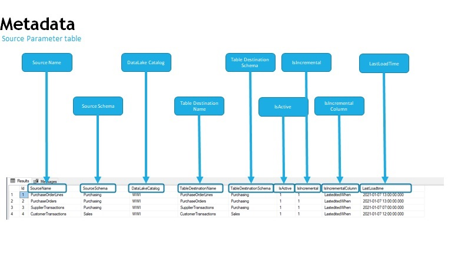

# AzureDataFactory  Metadata  and Parameters

Required Azure Data Services

Azure SQL Server
Azure Data Factory
Azure Data Lake Gen 2

Deploy the DacPac to Azure SQL Server

In Azure DataFactory created 3 Linked Services

LS_ADLS  =>  Azure Data Lake Gen 2 
LS_ASQL_SOURCE =>  Azure SQL Server  with your Source Database
LS_ASQL_CONFIG =>  Azure SQL Server  with your Metadata Database

Import the Template

Configure configuration].[Source_Parameter] table, with the required fields.

