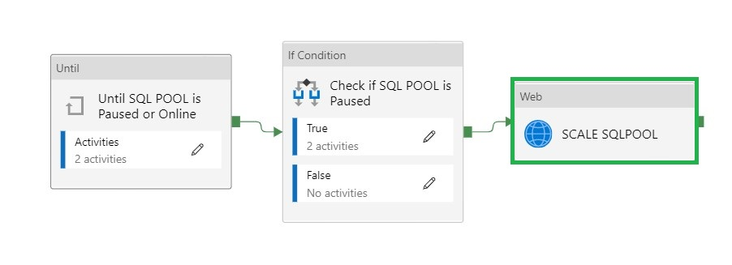
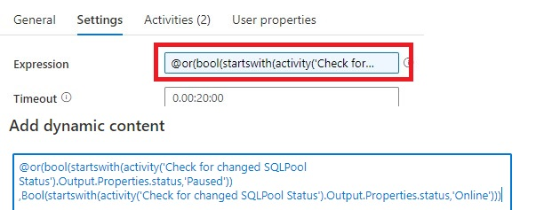
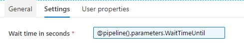
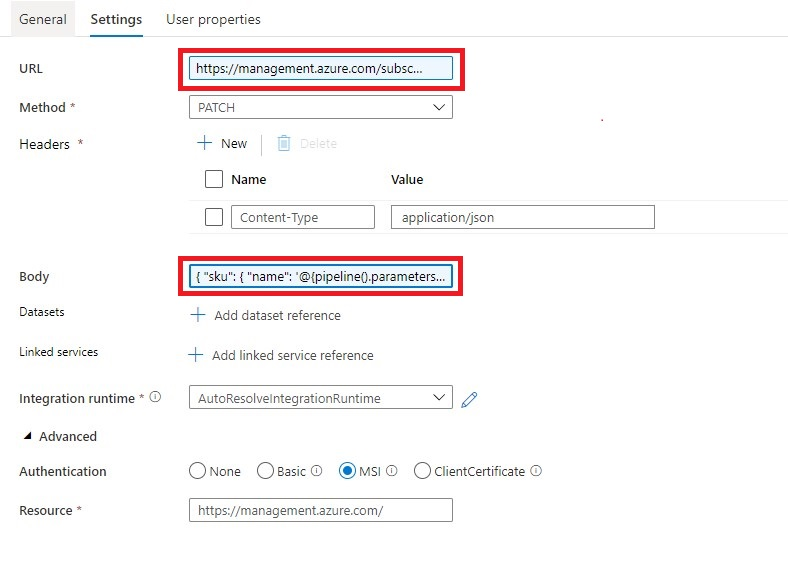
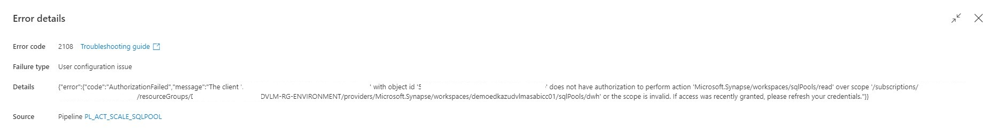
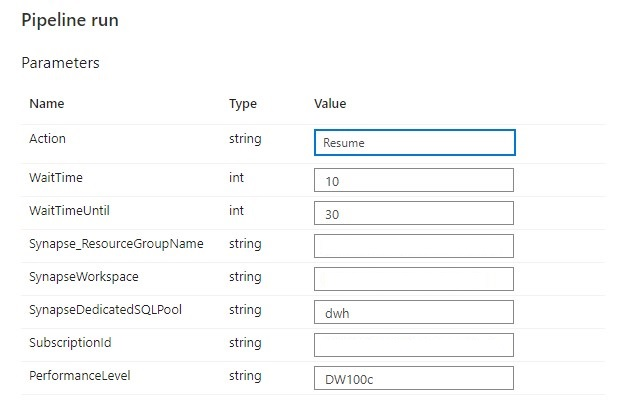
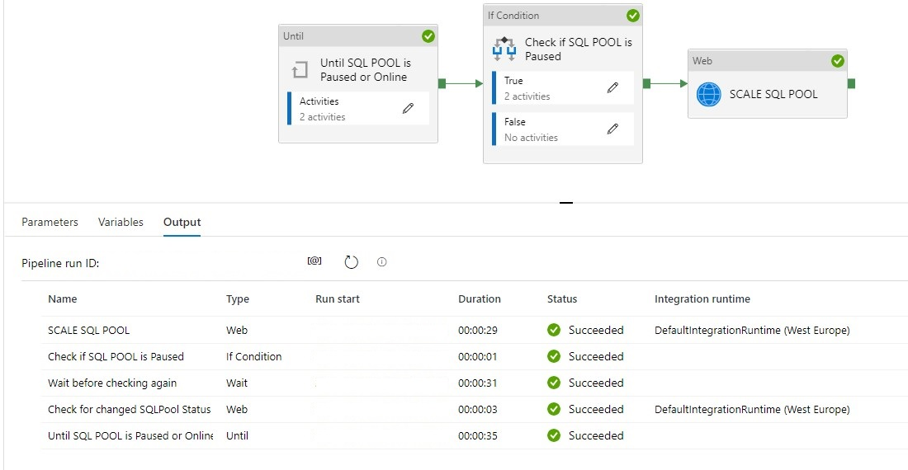

# Scale Dedicated SQL Pool Dynamically

Use this template to scale up and down a Dedicated SQL Pool in Azure Synapse Analytics. This pipelines is designed to Scale a SQL Pool within Azure Synapse Analytics. A SQL Pool(Former Azure SQL DW) linked to a SQL (Logical) Server has a slightly different approach. 
This article describes a solution template how you can Scale up or down a SQL Pool within Azure Synapse Analytics. This is actually a necessary functionality during your Data Movement Solutions. In this way you can optimize costs.

## The template contains 7 activities
- **Until Activity** to check a set of activities in a loop until the condition associated with the activity evaluates to true.
	- **Web Activity**  activity which will check the current Status of the SQL Pool
	- **Wait Activity** activity which will wait before retry to check the Status of the SQL Pool
- **If Condition Activity** Activity to check if the SQL Pool is Online
	- **Web Activity** Activity to Resume the SQL Pool if not Online
	- **Wait Activity** Activty to wait before to go to the next activity
- **Web Activity** Activity to Scale the SQL Pool up or down to the desired Performance Level

**Pipeline Parameters:**

| Parameter | Value | Deceription | 
|:--- |:--- |:--- |
|Action|   RESUME | Value needs to be **RESUME** to Scale
|WaitTime| 10| Wait time in seconds before the Pipeline will finish
|WaitTimeUntil| 30| Wait time in seconds for the retry process
|Synapse_ResourceGroupName|xxxxxx | Name of the ResourceGroup of the used Synapse Workspace
|SynapseWorkspace|xxxxxx| SynapseWorkspace|
|SynapseDedicatedSQLPool|DWH| Name of the dedicated SQL Pool|
|SubsriptionId|XXXX| SubscriptionId of Synapse Workspace|
|PerformanceLevel|DW1000c|  The Database Performance level (DW100c, DW200c, DW300c, DW400c DW500c, DW1000c, DW1000c, DW1500c, DW2000c, DW2500c, DW3000c, DW5000c, DW6000c, DW7500c, DW10000c, DW15000c, DW30000c)|

### How to use this solution template

After you imported the Template you will see the following:

# Until SQL POOL is Paused or Online

**Until Activity**
We can only change the PerformanceLevel when the SQL Pool is Paused or Online. That’s why we need to add an Until activity to check for these statusses 

**Web Activity**
Within the Until Activity we need to create a new Web Activity.

Name = Check for changed SQLPool Status

URL= https://management.azure.com/subscriptions/XXX/resourceGroups/XXX/providers/Microsoft.Synapse/workspaces/XXX/sqlPools/XXX/?api-version=2019-06-01-preview

Replace the **XXX** with Pipeline Parameters.

https://management.azure.com/subscriptions/@{pipeline().parameters.SubscriptionID}/resourceGroups/@{pipeline().parameters.Synapse_ResourceGroupName}/providers/Microsoft.Synapse/workspaces/@{pipeline().parameters.SynapseWorkspace}/sqlPools/@{pipeline().parameters.SynapseDedicatedSQLPool}/?api-version=2019-06-01-preview

Method = GET

Resource =https://management.azure.com/

After we have created the Web Activity, we can define the expression for the Until Activity.

The Pipeline can only continue when the status is Paused or Online and not one of the other statuses. That’s the reason we need to add these 2 two statuses to check for.

Expression: **@or(bool(startswith(activity(‘Check for changed SQLPool Status’).Output.Properties.status,’Paused’)),Bool(startswith(activity(‘Check for changed SQLPool Status’).Output.Properties.status,’Online’)))**

Time out: 0.00:20:00

The Until Activity will only continue, when the status from the above Web Activity output is Paused or Online, this can take a while and we don’t want to execute the Web Activity every time. That’s why we add a Wait Activity.

**Wait Activity**

A Wait Activity waits for the specified period of time before continuing with execution of subsequent activities.

# Check for the SQL Pool Status
**If Condition Activity** (Name: Check if SQL POOL is Paused). When is SQL Pool is  **Paused**, we need to **Resume**

Expression: **@bool(startswith(activity('Check for changed SQLPool Status').Output.Properties.status,'Paused'))**

**Web Activity** In case the SQL Pool is **Paused** we need to **Resume**
URL: https://management.azure.com/subscriptions/XXX/resourceGroups/XXX/providers/Microsoft.Synapse/workspaces/XXX/sqlPools/XXX/{Action}?api-version=2019-06-01-preview

Replace the **XXX** with Pipeline Parameters.

https://management.azure.com/subscriptions/{pipeline().parameters.SubscriptionID}/resourceGroups/{pipeline().parameters.Synapse_ResourceGroupName}/providers/Microsoft.Synapse/workspaces/{pipeline().parameters.SynapseWorkspace}/sqlPools/{pipeline().parameters.SynapseDedicatedSQLPool}/@{pipeline().parameters.Action}?api-version=2019-06-01-preview

It is almost the same URL we used in the First Web Actvity but have to add the action option **@{pipeline().parameters.Action}**

Method = Post

Header = {“Nothing”:”Nothing”}

Resource =https://management.azure.com/

**Wait Activity**  the purpose of this activity is to wait a period before we start ingestion data(just to be sure the SQL Pool in online)

Expression: **@pipeline().parameters.WaitTime**

# SCALE SQL POOL

**Web Activity**  "Scale SQL Pool"

Name = SCALE SQL POOL

URL= https://management.azure.com/subscriptions/XXX/resourceGroups/XXX/providers/Microsoft.Synapse/workspaces/XXX/sqlPools/XXX/?api-version=2019-06-01-preview

Replace the **XXX** with Pipeline Parameters.
https://management.azure.com/subscriptions/@{pipeline().parameters.SubscriptionID}/resourceGroups/@{pipeline().parameters.Synapse_ResourceGroupName}/providers/Microsoft.Synapse/workspaces/@{pipeline().parameters.SynapseWorkspace}/sqlPools/@{pipeline().parameters.SynapseDedicatedSQLPool}/?api-version=2019-06-01-preview

Method = PATCH

Headers =  Name = Content-Type     Value= application/json

Body = { “sku”: { “name”: ‘**@{pipeline().parameters.PerformanceLevel**}’ } }

Resource =https://management.azure.com/

# Important 
To allow Azure Data Factory to call the REST API we need to give the Azure Data Factory access to the SQL Pool. In the Access control (IAM) of the SQL Pool assign the contributor role to Azure Data Factory.

## Debug
Select **Debug**, enter the **Parameters**, and then select **Finish**.

When the pipeline run completes successfully, you would see the result similar to the following example:

A SQL Pool(Former SQL DW)
- [Settings for a SQL Pool(Former SQL DW)](Settings-Dedicated-SQL-Pool-Former-SQLDW.md) 