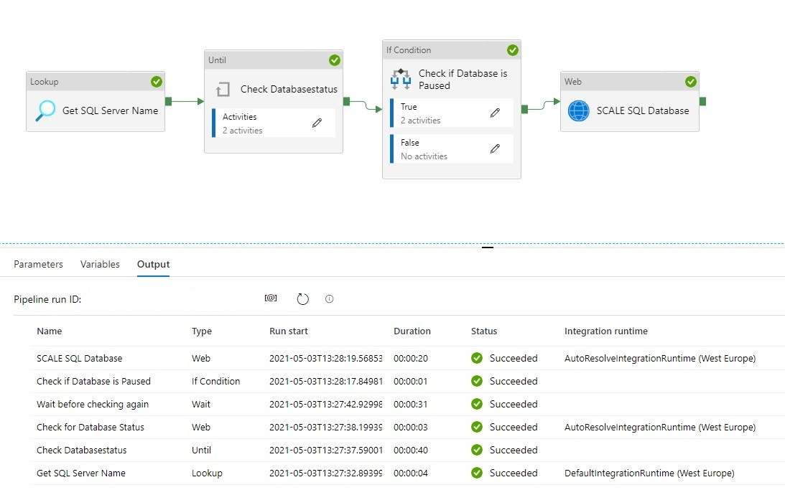

# Scale SQL Database Dynamically with Metadata

Use this template to scale up and down an Azure SQL Database in Azure Synapse Analytics or in Azure Data Factory. 

This article describes a solution template how you can Scale up or down a SQL Database within Azure Synapse Analytics or Azure Data Factory based on metadata. This is actually a necessary functionality during your Data Movement Solutions. In this way you can optimize costs and gain more performance during batch loading.

## The template contains 8 activities
- **Lookup Activity** Get the necessary metadata from a table in your configuration database.
- **Until Activity** to check a set of activities in a loop until the condition associated with the activity evaluates to true.
	- **Web Activity**  activity which will check the current Status of the SQL Pool
	- **Wait Activity** activity which will wait before retry to check the Status of the SQL Database
- **If Condition Activity** Activity to check if the SQL Database is Online
	- **Web Activity** Activity to Resume the SQL Database(Serverless only) if not Online
	- **Wait Activity** Activity to wait before to go to the next activity
- **Web Activity** Activity to Scale the SQL Database up or down to the desired DatabaseLevel


**Pipeline Parameters:**

| Parameter | Value | Description | 
|:--- |:--- |:--- |
|WaitTime| 10| Wait time in seconds before the Pipeline will finish
|WaitTimeUntil| 30| Wait time in seconds for the retry process
|DatabaseLevel|S1|  The Database Service Objective Name https://docs.microsoft.com/en-us/azure/azure-sql/database/resource-limits-vcore-single-databases  https://docs.microsoft.com/en-us/azure/azure-sql/database/resource-limits-dtu-single-databases
|DatabaseName|Datastore|  The Database Name| 


# How to use this solution template

Create a control table in Azure SQL Database to store the Metadata. 
>[!NOTE]
    > The table and stored procedure can be stored in any database, but preferred in a database where you store all your configuration in.
```sql
CREATE TABLE [configuration].[Environment_Parameter1](
	[ParameterId] [int] IDENTITY(1,1) NOT NULL,
	[ParameterName] [varchar](128) NOT NULL,
	[ParameterValue] [nvarchar](max) NOT NULL,
	[Description] [nvarchar](max) NULL,
	
CONSTRAINT [PK_Environment_Parameter1] PRIMARY KEY CLUSTERED 
    (
    	[ParameterId] ASC
    )WITH (STATISTICS_NORECOMPUTE = OFF, IGNORE_DUP_KEY = OFF, OPTIMIZE_FOR_SEQUENTIAL_KEY = OFF) ON [PRIMARY]
    ) ON [PRIMARY]
    
INSERT [configuration].[Environment_Parameter] ( [ParameterName], [ParameterValue], [Description]) VALUES (N'ResourceGroupName', N'yourResourceGroupName', N'ResourceGroupName of your Azure Synapse or ADF Instance')
GO
INSERT [configuration].[Environment_Parameter] ( [ParameterName], [ParameterValue], [Description]) VALUES (N'SubscriptionId', N'XXXXXXXX', N'SubscriptionId of your Azure Synapse or ADF Instance')
GO
INSERT [configuration].[Environment_Parameter] ( [ParameterName], [ParameterValue], [Description]) VALUES (N'SQLServer', N'yoursqlserver', N'Name of your SQL Server( Needed for scaling databases)')
GO
```


```sql
CREATE PROCEDURE [configuration].[Environment]
    @ColumnToPivot  NVARCHAR(255),
    @ListToPivot    NVARCHAR(max)
    AS
      /**********************************************************************************************************
    * SP Name:		[configuration].[[Environment]]
    *  
    * Purpose:		Procedure display record parameters for environment Settings
    *              
    *              
    * Revision Date/Time:
    *  2020-12-01		Erwin de Kreuk (InSpark) - Initial creation of SP
    *
    **********************************************************************************************************/
    BEGIN
     
      DECLARE @SqlStatement NVARCHAR(MAX)
      SET @SqlStatement = N'
        SELECT * FROM (
          SELECT
          
           [ParameterName] ,
           [ParameterValue]
          FROM [configuration].[Environment_Parameter]    ) EnvironmentTable
        PIVOT 
        (max([ParameterValue])
          FOR ['+@ColumnToPivot+']
          IN ('+@ListToPivot+' )    ) AS PivotTable  
      ';
     
      EXEC(@SqlStatement)
     
    END
```

After you have imported the Template you will see the following:
>[!NOTE]
    > Azure Synapse has no import functionality, create a new pipeline **PL_ACT_SCALE_SQLDATABASE** and copy the code into the pipeline. Once the pipeline is created manualy link the correct linked service for your Metadata table


Create a connection to the database where your metadata tables is stored. Followed by **use this template.**

**Lookup Activity**
Name = Get SQL Server Name


Source Dataset = Linked Services to your Metadata Table

Stored Procedures = configuration.environment

Parameters:
    
ColumnToPivot= ParameterName
    
ListToPivot= [ResourceGroupName],[SubscriptionId],[SQLServer]


## Until Check DatabaseStatus


**Until Activity**
We can only change the DatabaseLevel when the SQL Database is Paused or Online. That’s why we need to add an Until activity to check for these statusses.

**Web Activity**
Within the Until Activity we need to create a new Web Activity.


Name = Check for Database Status

URL= https://management.azure.com/subscriptions/XXX/resourceGroups/XXX/providers/Microsoft.Sql/servers/XXX/databases/XXX/?api-version=2019-06-01-preview

Replace the **XXX** with Pipeline Parameters.

https://management.azure.com/subscriptions/@{activity('Get SQL Server Name').output.firstRow.SubscriptionId}/resourceGroups/@{activity('Get SQL Server Name').output.firstRow.ResourceGroupName}/providers/Microsoft.Sql/servers/@{activity('Get SQL Server Name').output.firstRow.SQLServer}/databases/@{pipeline().parameters.DatabaseName}/?api-version=2019-06-01-preview

Method = GET

Resource =https://management.azure.com/

After we have created the Web Activity, we can define the expression for the Until Activity.


The Pipeline can only continue when the current status is not scaling. We can check this by comparing the currentServiceObjectiveName and the requestedServiceObjectiveName.

Expression: **@equals(activity('Check for Database Status').Output.Properties.currentServiceObjectiveName,activity('Check for Database Status').Output.Properties.requestedServiceObjectiveName)**

Time out: 0.00:20:00

The Until Activity will only continue, when the status from the above Web Activity output is equal, this can take a while and we don’t want to execute the Web Activity every time. That’s why we add a Wait Activity.

**Wait Activity**

A Wait Activity waits for the specified period of time before continuing with execution of subsequent activities.


# Check for the SQL Database Status (Serverless Only)
**If Condition Activity** (Name: Check if Database is Paused). When is SQL Database is  **Paused**, we need to **Resume**

Expression: **@bool(startswith(activity('Check for Database Status').Output.Properties.status,'Paused'))**

**Web Activity** In case the SQL Database is **Paused** we need to **Resume**
URL: https://management.azure.com/subscriptions/XXX/resourceGroups/XXX/providers/Microsoft.Sql/servers/XXX/databases/XXX/{Action}?api-version=2019-06-01-preview

The **XXX** are replaced with the output from Lookup activity.

https://management.azure.com/subscriptions/@{activity('Get SQL Server Name').output.firstRow.SubscriptionId}/resourceGroups/@{activity('Get SQL Server Name').output.firstRow.ResourceGroupName}/providers/Microsoft.Sql/servers/@{activity('Get SQL Server Name').output.firstRow.SQLServer}/databases/@{activity('Get SQL Server Name').output.firstRow.DatabaseName}/Resume?api-version=2019-06-01-preview

It is almost the same URL we used in the First Web Actvity but have to add the action option **Resume**.

Method = Post

Header = {“Nothing”:”Nothing”}

Resource =https://management.azure.com/

**Wait Activity**  the purpose of this activity is to wait a period before we start ingestion data(just to be sure the SQL Database is online)

Expression: **@pipeline().parameters.WaitTime**

# SCALE SQL Database

**Web Activity**  "SCALE SQL Database"


Name = SCALE SQL Database

URL= https://management.azure.com/subscriptions/XXX/resourceGroups/XXX/providers/Microsoft.sql/servers/XXX/databases/XXX/?api-version=2019-06-01-preview

The **XXX** are replaced with the output from Lookup activity.
https://management.azure.com/subscriptions/@{activity('Get SQL Server Name').output.firstRow.SubscriptionId}/resourceGroups/@{activity('Get SQL Server Name').output.firstRow.ResourceGroupName}/providers/Microsoft.Sql/servers/@{activity('Get SQL Server Name').output.firstRow.SQLServer}/databases/@{pipeline().parameters.DatabaseName}/?api-version=2019-06-01-preview

Method = PATCH

Headers =  Name = Content-Type     Value= application/json

Body = { “sku”: { “name”: ‘**@{pipeline().parameters.DatabaseLevel**}’ } }

Resource =https://management.azure.com/

# Important 
To allow Azure Synapse Analytics or Azure Data Factory to call the REST API we need to give the Synapse/ADF access to the SQL Database/Server. In the Access control (IAM) of the SQL Server assign the SQL Contributor role to Synapse/ADF.


## Debug
Select **Debug**, enter the **Parameters**, and then select **Finish**.

Define the correct DatabaseLevel and DatabaseName to Scale.

When the pipeline run completes successfully, you will see the result similar to the following example:



You can now call this pipeline from every other pipeline, you only need to change the DatabaseLevel and DatabaseName.


